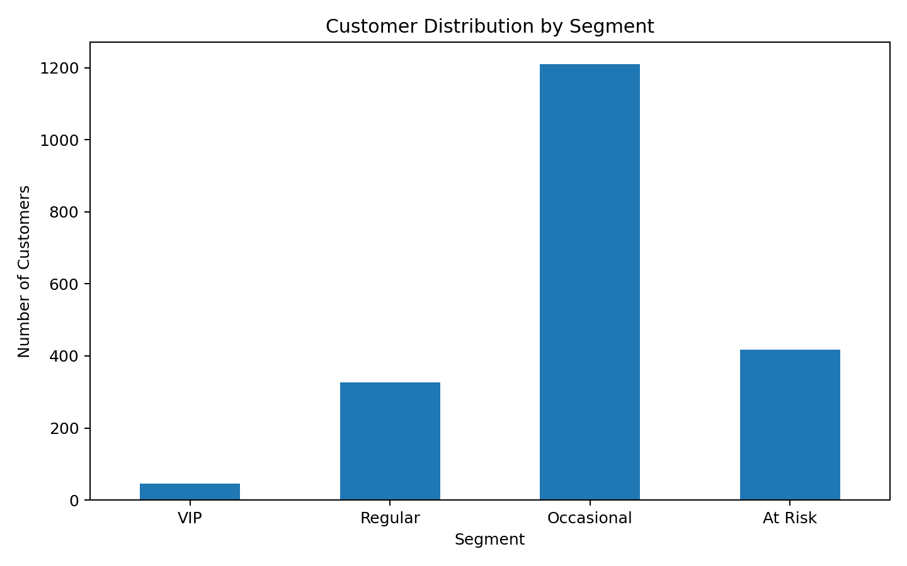
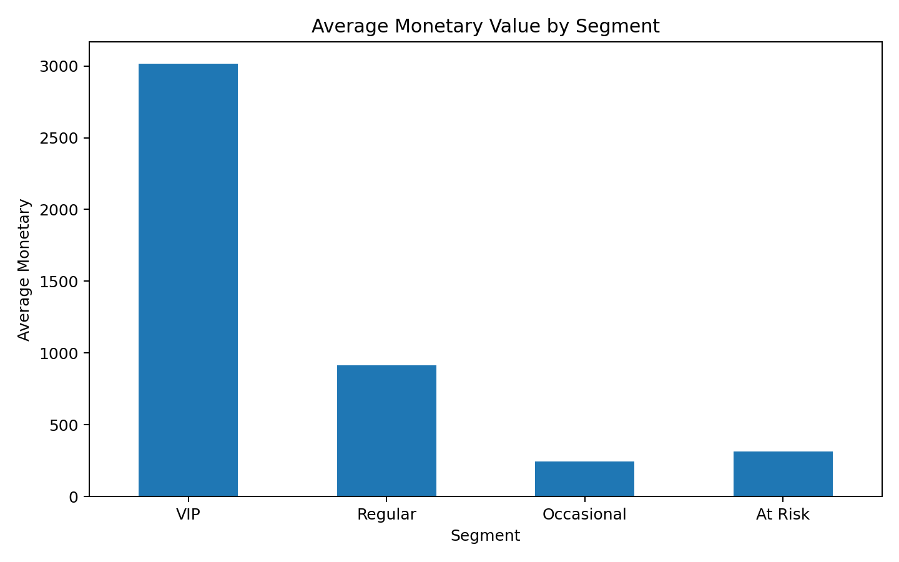
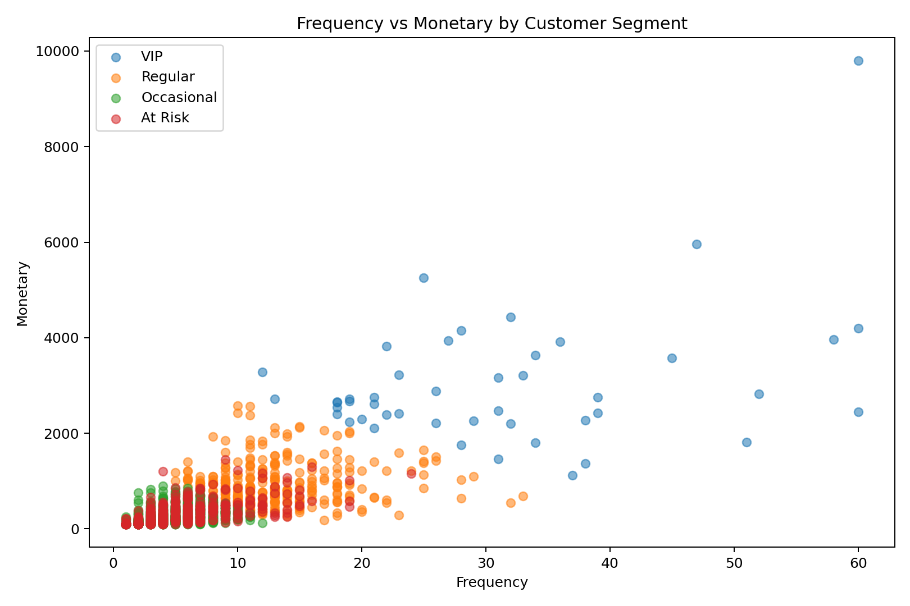
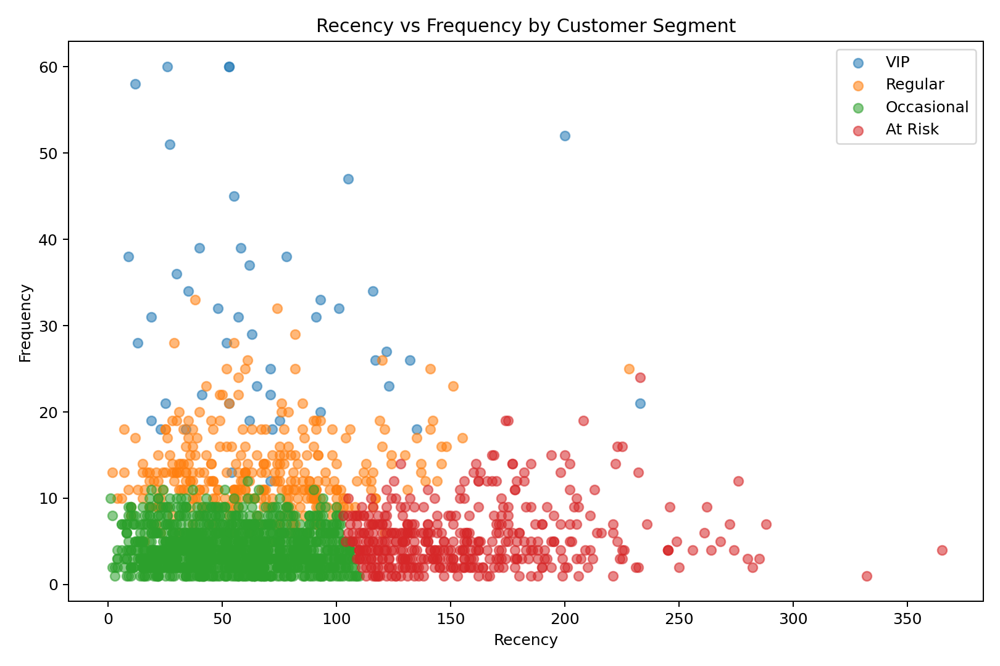
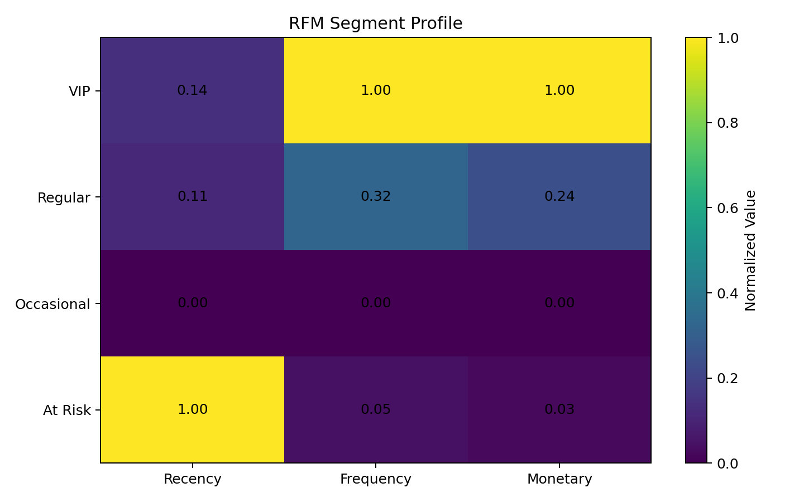

# 👥 Customer Segmentation Using RFM & K-Means

## 📌 Project Overview

This project applies **RFM Analysis and K-Means Clustering** to segment **2,000 customers** based on their purchasing behavior.

Customers are analyzed using three key behavioral dimensions:

- **Recency** — How recently a customer made a purchase
- **Frequency** — How frequently a customer purchases
- **Monetary** — How much a customer spends

The goal is to transform customer-level data into meaningful business segments that can support **customer targeting, retention, reactivation, and loyalty strategies**.

---

## 🎯 Project Objectives

- Analyze customer purchasing behavior using RFM metrics
- Apply K-Means clustering to identify distinct customer groups
- Evaluate different numbers of clusters using the Elbow Method and Silhouette Score
- Profile each cluster based on its RFM characteristics
- Translate statistical clusters into interpretable business segments
- Generate actionable customer strategy recommendations

---

## 🛠 Tools & Technologies

- Python
- Pandas
- Scikit-learn
- Matplotlib
- Jupyter Notebook
- Microsoft Excel
- K-Means Clustering
- RFM Analysis

---

## ⚙️ Analysis Workflow

```text
Customer Data
      ↓
Data Quality Checks
      ↓
RFM Feature Selection
      ↓
Feature Standardization
      ↓
Cluster Evaluation
      ↓
K-Means Clustering
      ↓
Cluster Profiling
      ↓
Business Segmentation
      ↓
Visual Analysis & Recommendations
```

---

## 🧠 Clustering Approach

Since K-Means is distance-based, the RFM variables were standardized using **StandardScaler** before clustering.

Different values of **K (2–8)** were evaluated using:

- Elbow Method
- Silhouette Score

A **4-cluster solution** was retained to create four interpretable customer groups for business segmentation.

Rather than assigning business labels directly to arbitrary cluster IDs, segment names were derived from the observed RFM characteristics of each cluster.

---

## 👥 Customer Segments

The final segmentation produced four customer groups:

| Segment | Customers | Share | Business Interpretation |
|---|---:|---:|---|
| **VIP** | 46 | 2.3% | High-value and highly engaged customers |
| **Regular** | 326 | 16.3% | Active repeat customers |
| **Occasional** | 1,210 | 60.5% | Largest group with lower purchasing engagement |
| **At Risk** | 418 | 20.9% | Customers with long recency requiring reactivation |

---

# 📊 Visual Analysis

## 1. Customer Distribution by Segment

Shows how the customer base is distributed across the four identified segments.



**Key Finding:**  
Occasional customers represent the largest segment, accounting for approximately **60.5%** of the customer base.

---

## 2. Average Monetary Value by Segment

Compares the average customer monetary value across the identified segments.



**Key Finding:**  
VIP customers demonstrate substantially higher monetary value than the other customer groups despite representing the smallest segment.

---

## 3. Frequency vs Monetary by Segment

Explores the relationship between purchase frequency and customer monetary value.



**Key Finding:**  
Higher purchasing frequency is generally associated with greater customer value, with VIP customers concentrated among the strongest frequency and monetary combinations.

---

## 4. Recency vs Frequency by Segment

Examines the relationship between how recently customers purchased and how frequently they purchase.



**Key Finding:**  
The visualization separates highly engaged customers from customers with longer periods since their last purchase, helping identify potential reactivation opportunities.

---

## 5. RFM Segment Profile

Provides a normalized comparison of Recency, Frequency, and Monetary characteristics across the four segments.



**Key Finding:**  
Each segment demonstrates a distinct behavioral profile, supporting differentiated customer strategies instead of treating the entire customer base uniformly.

---

## 💡 Business Recommendations

- **VIP Customers:** Focus on retention through loyalty programs, exclusive offers, and personalized rewards.
- **Regular Customers:** Encourage progression toward VIP status through targeted upselling and loyalty incentives.
- **Occasional Customers:** Increase engagement and purchase frequency through personalized campaigns and relevant promotions.
- **At Risk Customers:** Prioritize reactivation campaigns, win-back offers, and targeted communication.

---

## 📁 Repository Structure

All project files are stored directly in the main repository.

```text
Customer-Segmentation-RFM-KMeans/
│
├── README.md
├── RFM_Customer_Segmentation.ipynb
├── RFM_KMeans_2000_Customers.xlsx
├── RFM_KMeans_2000_Customers_Segmented.xlsx
├── 01_Customer_Distribution_by_Segment.png
├── 02_Avg_Monetary_by_Segment.png
├── 03_Frequency_vs_Monetary.png
├── 04_Recency_vs_Frequency.png
└── 05_RFM_Segment_Profile.png
```

---

## 📂 Project Files

| File | Description |
|---|---|
| `RFM_Customer_Segmentation.ipynb` | Complete Python workflow including preprocessing, cluster evaluation, K-Means modeling, segmentation, and visualization |
| `RFM_KMeans_2000_Customers.xlsx` | Original RFM customer dataset |
| `RFM_KMeans_2000_Customers_Segmented.xlsx` | Final dataset containing cluster and business segment assignments |
| `01_Customer_Distribution_by_Segment.png` | Customer segment distribution visualization |
| `02_Avg_Monetary_by_Segment.png` | Average monetary value comparison |
| `03_Frequency_vs_Monetary.png` | Frequency and monetary relationship across segments |
| `04_Recency_vs_Frequency.png` | Recency and frequency relationship across segments |
| `05_RFM_Segment_Profile.png` | Overall normalized RFM segment comparison |

---

## 🔑 Key Skills Demonstrated

- Customer Segmentation
- RFM Analysis
- Unsupervised Machine Learning
- K-Means Clustering
- Feature Scaling
- Cluster Evaluation
- Customer Profiling
- Data Visualization
- Business Insight Generation

---

## 👩‍💻 Author

**Kariman Muhammad Ahmad**  
Data Analyst
